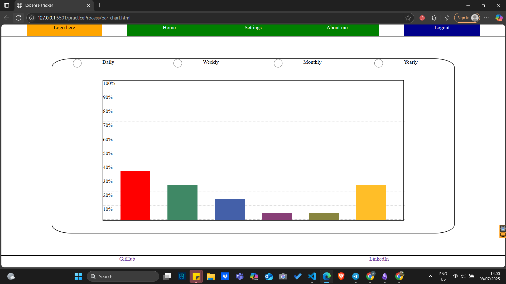
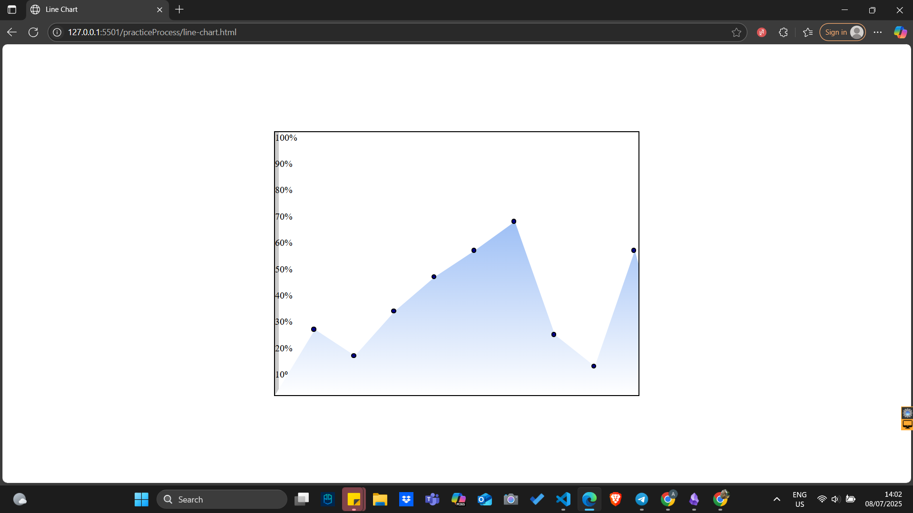
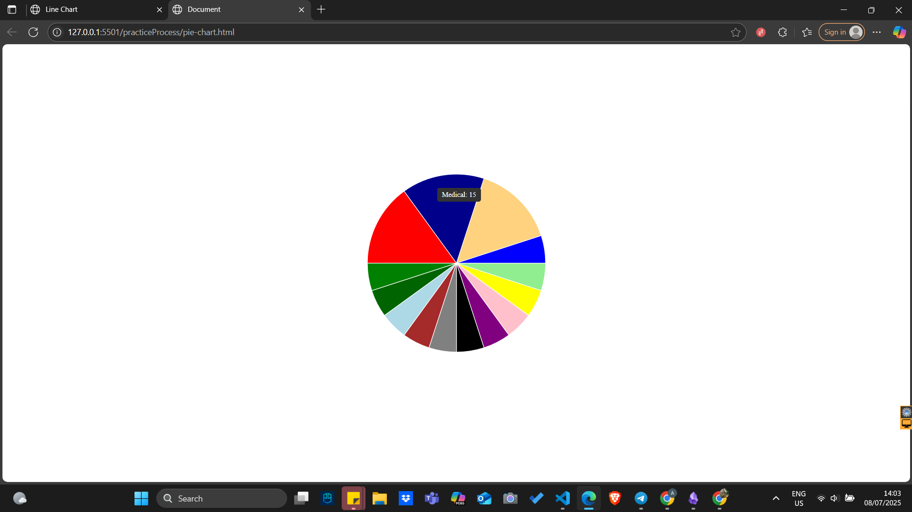

# Practice Process

The files in this directory are simply separate small projects, which were created so that the main project will not be filled with "dirty" code.
The projects are about building a line chart, pie chart and bar chart. They are not completely functional as they are basic prototypes of what the real charts should do in the actual project. For the pie chart there is interactivity allowed -> the positions can be manually changed by dragging adn dropping.

**Bar Chart**:

**Line Chart**:

**Pie Chart**:

